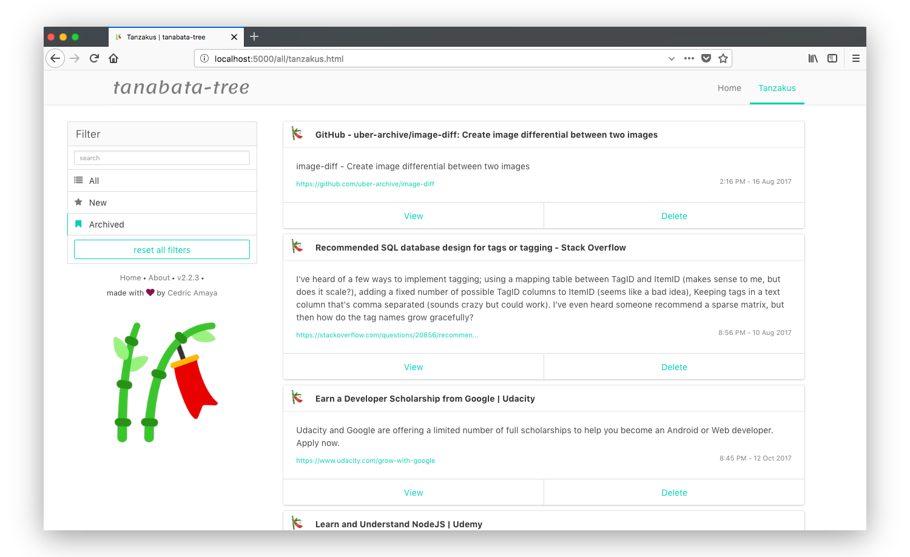

# tanabata-tree
### Personal save-it-later web application.

## What is it?
There's plenty of bookmarking apps out there, it's even a builtin feature on all browsers. But what about managing those links that you only need temporarialy? That is where **tanabata-tree** comes in. This simple application makes it easy to add and remove *"tanzakus"*, which are objects containing meta information based on the link you want saved for later. *Tanzakus* include the following info: a title (autogenerated and can be edited), the URL of the link, a description of the link, and the date and time the *tanzaku* was added.

### [Try the demo now!](https://tanabata-tree-demo.herokuapp.com/)

## How does it work?
They say a picture is worth a thousand words, so take a look at **tanabata-tree's** beautiful UI:

<p align="center">
  
</p>

But actually it's really simple. You type or paste the URL of the link you want saved on the homepage. If you're patient for like one or two seconds, a title will be autogenerated for the given link. You then submit and you'll be redirected to the page where you can see all of your tanzakus. From there, you can view the tanzakus or delete them if you no longer need it. <a href="https://raw.githubusercontent.com/cedricium/tanabata-tree/master/frontend/resources/tanabata-tree_demo.gif">Click here to view the demo gif</a>.

## How to set it up?
**tanabata-tree** can easily be hosted on Heroku and uses a Heroku PostgreSQL database for storing the tanzakus (all of this done with the free tier so need to pay anything. :raised_hands:)

[](https://heroku.com/deploy?template=https://github.com/cedricium/tanabata-tree/tree/master)

### Provisioning

1. Start by clicking the above "Deploy to Heroku" button.
2. Follow the steps on Heroku to complete the deployment.
3. Once app is deployed, visit https://dashboard.heroku.com/apps/[your_tanabata-tree_app_name]/resources and click on the "Heroku Postgres" addon link.
4. Once page has loaded, go to "Settings" and select "View Credentials".
5. With your crendentials handy, use a PostgreSQL client (PGAdmin or Postico are good options) or [`heroku pg:psql`](https://devcenter.heroku.com/articles/heroku-postgresql#pg-psql) in the CLI to connect to the database.
6. Create a new query and paste the following line to create the *tanabata-tree* table:
  ```sql
  CREATE TABLE tanabata_tree (id uuid, url VARCHAR(2000), title TEXT, description TEXT, been_visited BOOLEAN DEFAULT false, created_at TIMESTAMP DEFAULT NOW());
  ```
7. You're all set, your very own **tanabata-tree** instance is ready to go!

## What else is planned?
- [x] ability to archive *tanzakus* that are needed for longer
- [x] filtering and sorting based on tags and archived, new, or all
- [ ] tagging of *tanzakus*
- [ ] bug fixes of course!